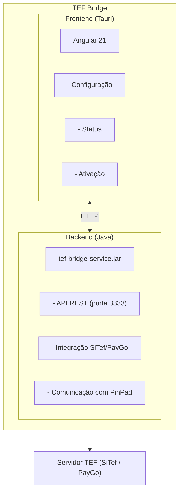

# TEF Bridge

<p align="center">
  
  
  
  
  
</p>

## Sobre o Projeto

**TEF Bridge** é uma aplicação desktop multiplataforma desenvolvida para facilitar a integração de sistemas PDV (Ponto de Venda) com operadoras de TEF (Transferência Eletrônica de Fundos). A aplicação atua como uma ponte entre o software de automação comercial e os provedores de pagamento eletrônico.

### Objetivo

Simplificar e padronizar a comunicação entre sistemas de frente de caixa e as principais operadoras de TEF do mercado brasileiro, oferecendo uma interface moderna, intuitiva e de fácil configuração.

## Arquitetura

O sistema é composto por dois componentes principais:



### Frontend (Este repositório)
- Interface gráfica desenvolvida em **Angular 21** + **Tauri**
- Responsável pela configuração, ativação e monitoramento
- Comunica com o backend via HTTP REST (localhost:3333)

### Backend (tef-bridge-service.jar)
- Serviço Java que executa em background
- Responsável pela comunicação real com as operadoras TEF
- Integra com as DLLs/bibliotecas do **SiTef** e **PayGo**
- Gerencia a comunicação com o **PinPad**
- Expõe API REST para o frontend

## Funcionalidades

- **Ativação por Licença** - Sistema de licenciamento para controle de uso
- **Configuração de Provedores** - Suporte a múltiplos provedores TEF:
  - **SiTef** - Software Express
  - **PayGo** - Tecnospeed (em desenvolvimento)
- **Monitor de Status** - Acompanhamento em tempo real do status das conexões:
  - Servidor SiTef
  - PinPad
  - Serviço TEF
- **Interface Moderna** - UI dark mode com design profissional

## Tecnologias Utilizadas

| Tecnologia | Versão | Descrição |
|------------|--------|-----------|
| **Angular** | 21.x | Framework frontend |
| **Tauri** | 2.x | Framework para apps desktop |
| **Rust** | 1.93+ | Backend nativo (Tauri) |
| **Java** | 17+ | Backend de integração TEF |
| **TypeScript** | 5.x | Linguagem principal frontend |
| **SCSS** | - | Estilização |

## Pré-requisitos

Antes de começar, certifique-se de ter instalado:

- [Node.js](https://nodejs.org/) (v20 ou superior)
- [Rust](https://www.rust-lang.org/tools/install) (v1.93 ou superior)
- [Java JRE/JDK](https://adoptium.net/) (v17 ou superior) - para o backend
- [Visual Studio Build Tools](https://visualstudio.microsoft.com/visual-cpp-build-tools/) (Windows - com C++ Desktop Development)

## Instalação

1. **Clone o repositório**
```bash
git clone https://github.com/seu-usuario/front-tef-bridge.git
cd front-tef-bridge
```

2. **Instale as dependências**
```bash
npm install
```

3. **Execute em modo desenvolvimento**
```bash
npm run tauri:dev
```

## Scripts Disponíveis

| Comando | Descrição |
|---------|-----------|
| `npm start` | Inicia o servidor Angular (porta 4200) |
| `npm run build` | Build de produção do Angular |
| `npm run tauri:dev` | Executa a aplicação Tauri em modo dev |
| `npm run tauri:build` | Gera o instalador (.exe para Windows) |
| `npm test` | Executa os testes unitários |

## Estrutura do Projeto

```
front-tef-bridge/
├── src/
│   ├── app/
│   │   ├── pages/
│   │   │   ├── ativacao/        # Tela de ativação de licença
│   │   │   ├── configuracao/    # Configuração do provedor TEF
│   │   │   └── status/          # Monitor de status
│   │   ├── services/
│   │   │   └── tef-bridge.service.ts  # Serviço principal TEF
│   │   ├── app.routes.ts        # Rotas da aplicação
│   │   └── app.config.ts        # Configuração do Angular
│   ├── styles.scss              # Estilos globais
│   └── index.html               # HTML principal
├── src-tauri/
│   ├── src/
│   │   └── main.rs              # Entry point Rust/Tauri
│   ├── tauri.conf.json          # Configuração do Tauri
│   └── Cargo.toml               # Dependências Rust
├── angular.json                 # Configuração Angular CLI
├── package.json                 # Dependências Node.js
└── README.md                    # Este arquivo
```

## Screenshots

### Tela de Ativação
Interface para inserir a chave de licença e ativar o sistema.

### Tela de Configuração
Configuração dos parâmetros de conexão com o provedor TEF (IP, Terminal, Empresa).

### Monitor de Status
Visualização em tempo real do status das conexões com o servidor e dispositivos.

## Configuração SiTef

Para configurar a conexão com o SiTef, você precisará das seguintes informações:

| Campo | Descrição | Exemplo |
|-------|-----------|---------|
| **IP do Servidor** | Endereço do servidor SiTef | `192.168.1.100` |
| **Terminal** | Código do terminal (8 dígitos) | `00000001` |
| **Empresa** | Código da empresa (8 dígitos) | `00000000` |

## Backend Java (tef-bridge-service)

O backend é um serviço Java responsável por toda a comunicação com as operadoras TEF. Ele deve estar em execução para que o frontend funcione corretamente.

### Executando o Backend

```bash
java -jar tef-bridge-service.jar
```

O serviço será iniciado na porta **3333** e ficará aguardando requisições do frontend.

### Endpoints da API

| Método | Endpoint | Descrição |
|--------|----------|-----------|
| `GET` | `/status` | Retorna status geral do serviço |
| `GET` | `/health` | Verifica saúde da conexão TEF |
| `POST` | `/licenca/validar` | Valida uma chave de licença |
| `POST` | `/configuracao` | Salva configurações do provedor |
| `POST` | `/transacao/debito` | Inicia transação de débito |
| `POST` | `/transacao/credito` | Inicia transação de crédito |
| `POST` | `/transacao/cancelar` | Cancela última transação |

### Estrutura do Backend

```
tef-bridge-service/
├── src/main/java/
│   ├── config/           # Configurações do Spring Boot
│   ├── controller/       # Controllers REST
│   ├── service/          # Lógica de negócio
│   │   ├── SitefService.java
│   │   └── PaygoService.java
│   ├── integration/      # Integração com DLLs TEF
│   └── model/            # DTOs e entidades
├── libs/
│   ├── CliSiTef32.dll    # DLL SiTef (32 bits)
│   ├── CliSiTef64.dll    # DLL SiTef (64 bits)
│   └── PayGoLibrary.dll  # DLL PayGo
└── pom.xml               # Dependências Maven
```

### Configuração do Backend

O backend utiliza um arquivo `application.properties` ou `application.yml`:

```yaml
server:
  port: 3333

tef:
  provedor: sitef  # sitef ou paygo
  sitef:
    ip: 192.168.1.100
    terminal: "00000001"
    empresa: "00000000"
  pinpad:
    porta: COM3
```
| **Empresa** | Código da empresa (8 dígitos) | `00000000` |

## Build de Produção

Para gerar o instalador Windows (.exe):

```bash
npm run tauri:build
```

O instalador será gerado em:
```
src-tauri/target/release/bundle/nsis/TEF Bridge_1.0.0_x64-setup.exe
```

## Contribuindo

Contribuições são bem-vindas! Sinta-se à vontade para:

1. Fazer um Fork do projeto
2. Criar uma branch para sua feature (`git checkout -b feature/NovaFeature`)
3. Commit suas mudanças (`git commit -m 'Add: nova feature'`)
4. Push para a branch (`git push origin feature/NovaFeature`)
5. Abrir um Pull Request

## Licença

Este projeto está sob a licença MIT. Veja o arquivo [LICENSE](LICENSE) para mais detalhes.

## Autor

Desenvolvido para facilitar integrações TEF no Brasil.

---

<p align="center">
  <strong>TEF Bridge</strong> - Conectando seu PDV ao mundo dos pagamentos eletrônicos
</p>
